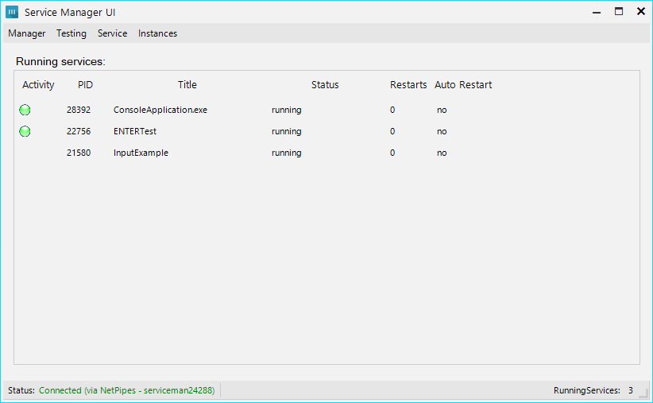
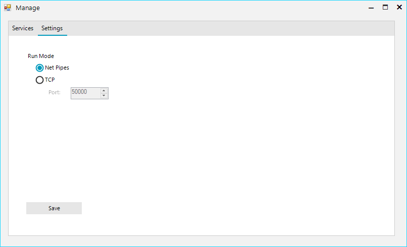
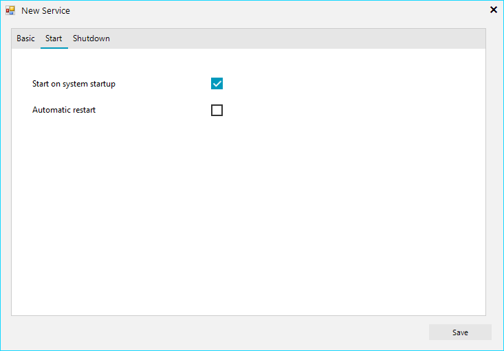
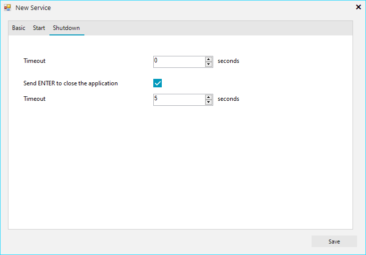

# ServiceManager
A tool for managing mostly console applications like Cronjobs.

Developed with C# and make use of Telerik WinForms controls.

The network communication is done via WCF. It allows you to use Net Pipes or TCP connections with a custom Port.

Authentication is not integrated yet. => Todo List

- [Main Window](#mainwindow)
- [Network Settings](#network-settings)
- [Service Settings - Start](#service-settings---start)
- [Service Settings - Shutdown](#service-settings---shutdown)
- [Live Console In and Output](#live-console-in-and-output)

## MainWindow

## Network Settings

Choose between Net Pipes and TCP connection for your Service Manager.

## Service Settings - Start

Enable automatic start with the Service (system) and allow automatic restart when service ends or crashes.

## Service Settings - Shutdown

Timeout before service gets killed when not responding to exit signal.

Good for console applications allow pressing ENTER before running Timeout.

After the timeout it will get killed.

## Live Console In and Output

Get directly output from your console applications and send back informations over the network.

