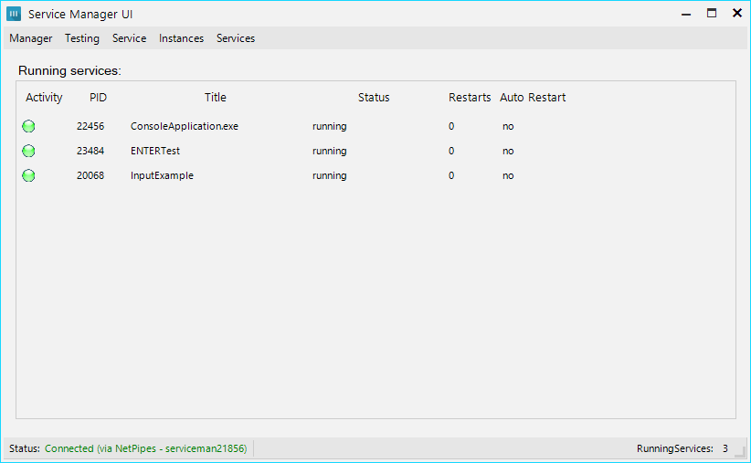
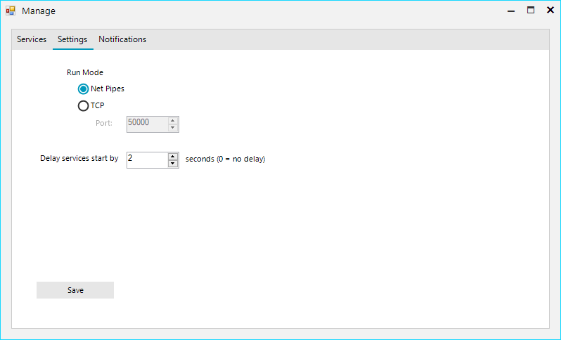

# ServiceManager
A tool for managing mostly console applications like Cronjobs.

Developed with C# and make use of Telerik WinForms controls.

The network communication is done via WCF.

## MainWindow

## Network Settings

Choose between Named Pipes and TCP connection for your Service Manager.

## Service Settings - Start

Enable automatic start with the Service (system) and allow automatic restart when service ends or crashes.

## Service Settings - Shutdown

Timeout before service gets killed when not responding to exit signal.

Good for console applications allow pressing ENTER before running Timeout.

After the timeout it will get killed.

## Live Console In and Output

Get directly output from your console applications and send back informations over the network.

